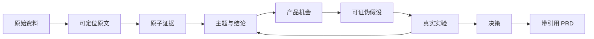

# 产品定义

## 一句话定位

DiscoveryLab 帮助产品团队把零散、矛盾、质量不一的用户资料，转化为可追溯的产品判断，并用真实实验持续修正这些判断。

## 核心用户

第一用户是 B2B SaaS 产品经理；第二用户是产品负责人、创业团队、FDE、售前和客户成功团队。

他们共同面对的任务是：

> 在研发资源有限时，判断哪一个问题最值得优先验证，并向团队解释这个判断来自哪些事实、还有哪些反证和未知项。

## 核心业务对象：Study

用户创建的不是聊天会话，而是一项围绕具体决策的 `Study`。一个合格的 Study 必须包含：

- 要做出的决策，而不是泛泛的研究主题。
- 目标用户群和数据范围。
- 候选方案、限制与失败成本。
- 当前基线指标。
- 已知假设和最大未知项。
- 决策截止时间和最终负责人。
- 什么新证据会改变当前判断。

## 产品闭环

产品必须把以下四类内容视觉和数据隔离：

1. 真实原文和行为数据。
2. 从原文提取的观察事实。
3. AI 或人工做出的解释与推断。
4. Persona 等模拟输出。

## 核心页面

MVP 重点打磨五个页面，而不是做十几个半成品页面。

### Evidence Explorer

- 原文与原子证据并排展示。
- 点击证据回到 PDF 页码、CSV 行或文本段落。
- 区分 Quote、Observation、Interpretation 和 Inference。
- 支持审核、修订、去重、用户分群和证据过期。

### Opportunity / Claim Inspector

- 展示支持证据、反对证据、背景证据和缺失用户群。
- 按独立账户或用户计数，不能按引用条数夸大需求。
- 展示来源比例、数据新鲜度和抽样偏差。
- 允许用户合并、拆分和锁定主题。

### Agent Run Inspector

- 展示 Workflow 步骤、Context Manifest、工具调用和审批。
- 展示 Prompt/模型/Schema 版本、成本、延迟、重试和 Checkpoint。
- 支持暂停、恢复、取消、从失败步骤重试和版本对比。

### Eval & Bad Case Center

- 比较单 Prompt、普通 RAG 和完整 Workflow。
- 展示引用准确率、反面证据召回、无依据结论和工具正确性。
- 保存失败案例、根因、修复和回归结果。

### Decision & PRD Center

- 展示审批后形成的 Hypothesis 与 Experiment Draft。
- 由人记录 append-only Product Decision，而不是让 Agent 自动决定路线图。
- 生成固定为 DRAFT 的 PRD，并展示 Claim、Evidence、Source、Review、Locator 与哈希 citation。
- 明确展示最终审核与外部发布阻断项。

## HelpHub 种子案例

HelpHub 是一家虚构的 B2B 客服软件公司，只能选择一个方向进入下一季度：

1. AI 自动回复。
2. 工单自动分类。
3. 高风险问题识别与升级。

当前种子数据包含访谈 Markdown 和工单 CSV，并故意加入分群冲突、分类错误、反面证据、低风险替代需求和 Prompt Injection。所有公司、人物、事件与离线实验结果都明确标为合成作品集数据。

系统应揭示一个非显而易见的判断：自动回复被提到最多，但高风险问题未及时升级与 SLA 违约、工单重开和企业客户流失的关系更强。下一步不是直接开发，而是验证“提供风险依据并由客服确认升级”的可接受性。

## 当前作品集交付

- Study 和 Decision Brief。
- TXT/Markdown、PDF 和 CSV 导入。
- Source Revision、内容哈希和原文件快照。
- PDF 页码与 CSV 稳定行 ID 定位。
- Evidence 抽取、审核、修订和原文回跳。
- 混合检索、支持证据和反面证据。
- Claim、Opportunity 和可证伪 Hypothesis。
- Evidence Review、Claim Review 与精确 Tool Approval 三类人工权威节点。
- Experiment Draft 和带引用 PRD。
- 一个带精确参数审批的本地写工具；明确不冒充外部系统写入。
- LangGraph 状态机、审批中断/恢复和 Run Inspector。
- 20–30 个 Eval Cases、Bad Case Inbox 和一个攻击案例。
- 只读 MCP Server，暴露证据与决策查询。

## 可以延期

- Persona Lab；首版最多作为小型压力测试。
- 音频说话人分离和复杂 OCR。
- 大量外部连接器。
- Linear/Jira/Notion 等真实外部发布工具。
- 自动 Persona 校准。
- 多人实时协作和复杂企业权限。
- 图数据库、微服务和 Kubernetes。
- 任意自然语言 SQL。

## 产品不变量

- 原始 Source Revision 不可覆盖，只能新增版本。
- 正式 Evidence 必须有可解析 Locator。
- 正式 Claim 必须引用至少一条有效 Evidence Revision。
- 正式结论必须检索反面证据，或明确标记尚未执行。
- Persona 输出永远不能成为真实用户证据。
- `stale` 的结论和 PRD 不可直接发布。
- 外部写操作必须获得绑定具体参数和版本的 Approval。
- 删除原始资料后，依赖它的产物必须失效或重新计算。

## 成功指标

North Star：

> 在七天内形成“有人批准、证据可追溯、成功失败条件明确”的实验或决策的 Study 比例。

产品指标包括：

- 从导入到首个证据地图的时间。
- 找到原始证据的平均时间。
- 人工保留、修订和删除 AI 结论的比例。
- 被实验验证或推翻的假设比例。
- 从发现问题到批准实验的周期。

AI 与系统指标包括：

- 引用准确率和反面证据召回率。
- 无依据结论率和拒答正确率。
- Workflow 完成率、恢复率和工具违规数。
- p95 延迟与单次 Study 成本。
