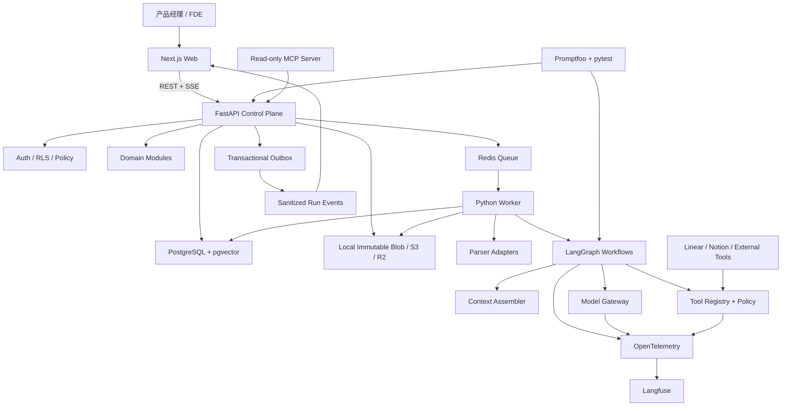

# 系统架构

## 架构结论

采用 **模块化单体 + 独立 Worker**，不做微服务。

代码按领域模块隔离，但首版只有三个可部署进程：

1. `web`：Next.js 产品界面。
2. `api`：FastAPI 业务 API、权限、事务与控制平面。
3. `worker`：与 API 共用 Python 领域代码，执行解析、索引和长时间 Agent Workflow。

PostgreSQL 是唯一业务事实源。Redis、LangGraph Checkpoint、向量索引和 Langfuse 都是可恢复或可重建的运行设施，不能成为业务真相。

## 架构原则

- Provenance-first：先设计来源、定位、版本和证据，再设计报告与聊天。
- Deterministic-first：哈希、权限、状态转换、定位、计数和指标由代码完成。
- Bounded agents：Agent 是受控 Workflow Node，不进行无边界自由对话。
- Human authority：内容审核和动作授权分别建模，不能用一个布尔值代替。
- Evaluation by design：Prompt、模型、检索和 Workflow 变化必须经过回归。
- Replaceable adapters：模型、解析器、连接器和对象存储不进入核心领域模型。
- Visible reliability：Context、工具、审批、失败恢复和评测必须在 UI 可见。

## 容器视图



## 领域模块

### Identity & Governance

负责 Workspace、Member、Role、访问策略、数据保留和连接器凭证。所有读写都必须显式携带 `tenant_id` 和 `workspace_id`。

### Study & Brief

负责 Project、Study、Decision Brief、Research Question、Cohort、Candidate Option、Constraint 和 Success Metric。

### Source & Ingestion

负责不可变 Source Revision、文件快照、解析、Locator、脱敏、去重和索引状态。

### Evidence & Provenance

负责 Evidence、审核、修订、实体、重复关系以及从派生结果回到原文的谱系。

### Discovery

负责 Theme、Claim、Claim–Evidence 边、Opportunity、Hypothesis、Experiment、Decision 和 PRD。

### Workflow & Tooling

负责 Workflow Definition、Run、Step、Attempt、Checkpoint、Context Manifest、Tool Call、Approval 和 Budget。

### Evaluation & Bad Cases

负责 Dataset、Case、Assertion、Eval Run、Score、Failure Case、Root Cause 和 Regression Group。

### Integrations & MCP

连接器和 MCP 都是适配器。它们只能通过应用服务调用领域能力，不得直接操作业务表。

## 依赖规则

```text
UI
→ Application Services
→ Domain Model
→ Ports
→ Infrastructure Adapters
```

- 领域层不能导入 LangGraph、模型 SDK、Redis、S3 或第三方连接器。
- LangGraph Node 只能调用应用服务和受控 Tool Port。
- Worker 和 API 共用领域规则、Schema 与 Repository 接口。
- 外部连接器不能直接写 `claims`、`evidence` 或 `decisions`。
- MCP Server 只能暴露经过权限检查的应用服务。

## 主数据流

### Source → Evidence

1. API 创建 Source 和不可变 Source Revision。
2. 原文件写入对象存储，数据库保存内容哈希和版本。
3. Transactional Outbox 投递解析任务。
4. Worker 解析文档并保存 Segment 与 Locator。
5. 确定性代码检查定位、权限、重复和 PII。
6. Agent Node 按 Schema 提取 Evidence Proposal。
7. Citation Verifier 以确定性代码检查原文、哈希和 Locator 能否精确回放；它明确不声称判断语义正确。
8. 模型产生的 observation / interpretation 仍是 proposal，语义支持性由后续评测和 Evidence Review 判断。
9. 审核后的 Evidence Revision 进入检索投影。

### Evidence → Decision

1. 混合检索分别寻找支持证据和反面证据。
2. Context Assembler 创建不可变 Context Manifest。
3. Analyst 生成 Theme、Claim 和 Opportunity 草案。
4. Skeptic 搜索反例、覆盖缺口和抽样偏差。
5. 人工合并、拆分、修订和锁定主题。
6. Hypothesis Node 生成可证伪假设。
7. 用户选择进入验证的假设。
8. Experiment Designer 生成实验草案。
9. 真实实验结果回流并更新 Decision。
10. PRD Composer 只使用已批准 Decision 和可用 Claim Revision。

### 外部写入

1. Agent 只能生成 Tool Call Proposal。
2. 服务端依据 Tool Contract 和 Policy 校验参数。
3. 高风险写入创建 Approval，包含参数哈希、数据范围、费用与有效期。
4. 参数、权限或引用 revision 变化会让 Approval 失效。
5. 批准后 Tool Executor 获得一次性能力并执行。
6. 幂等键防止重复创建 Linear/Jira 任务。

## LangGraph 的边界

LangGraph 用于：

- 显式 Workflow Graph。
- Node 输入输出 Schema。
- Interrupt/HITL。
- Checkpoint、暂停和恢复。
- 条件分支、重试和失败路由。

LangGraph 不负责：

- 业务对象的最终状态。
- Workspace/Study 权限。
- Evidence、Claim 和 Decision 的版本事实。
- Approval 的法律或业务授权状态。
- Prompt/Context/Eval 的长期审计。

每个 Node 完成后，应用服务在数据库事务中写入业务结果和 Run Step。LangGraph Checkpoint 丢失时，可以根据数据库中的 Input Snapshot、Step Attempt 和已提交结果重建或重新运行。

## 一致性与异步执行

- 任务采用至少一次投递。
- 每个 Job、Step Attempt、Tool Call 和 Publish 操作都带幂等键。
- 通过唯一约束和事务处理重复执行。
- API 在同一事务中写业务数据和 Outbox Event。
- Redis 只保存投递信息，不保存 Study 或 Run 权威状态。
- 单个文件失败不会阻塞整个 Study，可产生 `PARTIALLY_SUCCEEDED`。
- 超过最大重试次数进入 Failure Inbox/Dead Letter Queue。

## API 与实时事件

主要接口：

```text
POST /v1/studies
POST /v1/studies/{id}/sources
POST /v1/studies/{id}/runs
GET  /v1/runs/{id}
GET  /v1/runs/{id}/events
POST /v1/runs/{id}:pause
POST /v1/runs/{id}:resume
GET  /v1/evidence/{id}/context
PATCH /v1/themes/{id}
POST /v1/studies/{id}/hypotheses
POST /v1/studies/{id}/experiments
POST /v1/approvals/{id}:resolve
POST /v1/artifacts/{id}:publish
GET  /v1/studies/{id}/evals
```

前端通过 SSE 获取脱敏事件。事件只包含对象 ID、状态、耗时、脱敏摘要和关联 ID，不包含原始客户资料、完整 Prompt、凭证或 PII。

## 部署拓扑

### 本地

Docker Compose 首先启动 PostgreSQL/pgvector 与 Redis。原文件在开发期通过同一 Storage Port 写入本地不可变 Blob 目录；线上把适配器切到 S3/R2。`web`、`api` 与 `worker` 在应用骨架建立后加入，Langfuse 首期只接可关闭的 SDK/OTel，不自托管整套服务。

### 在线 Demo

- Web：Vercel。
- API/Worker：Railway、Fly.io 或 Render。
- PostgreSQL/pgvector：Supabase 或其他托管 PostgreSQL。
- 文件：Cloudflare R2。
- Redis：Upstash 或托管 Redis。
- Trace：Langfuse Cloud 或自托管。

公开 Demo 只使用合成或脱敏数据，并对临时上传设置自动删除。

## 架构门禁

开始编码前必须确认：

- 领域边界没有让 LangGraph 或连接器成为业务事实源。
- Evidence Locator 在 MVP 支持的三种来源上可实现。
- Revision、Input Snapshot 和 stale 传播规则一致。
- Review 与 Approval 被分开建模。
- Eval 能覆盖每条核心路径和至少一个安全攻击。
- 第一个垂直切片可以独立演示 Source → Evidence → 原文回跳。
